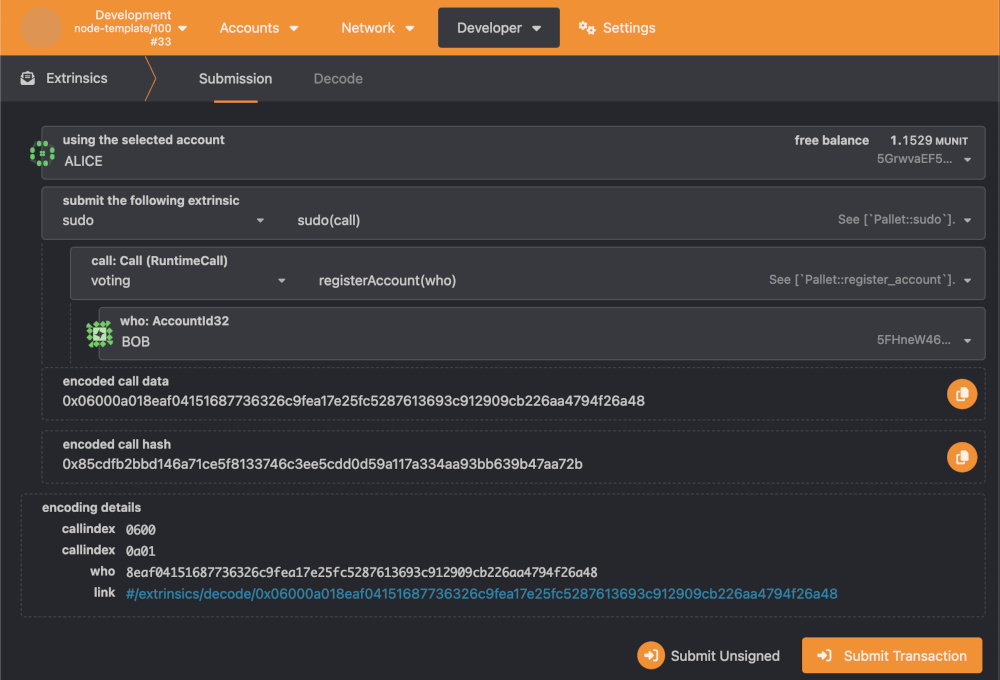
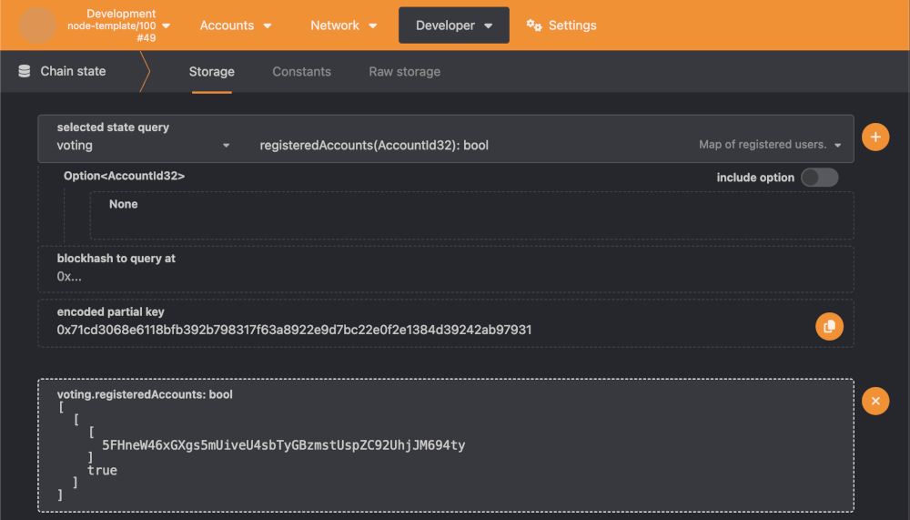
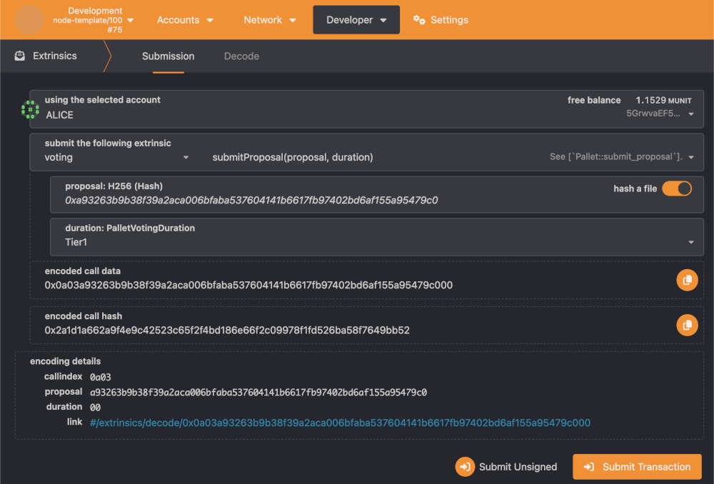
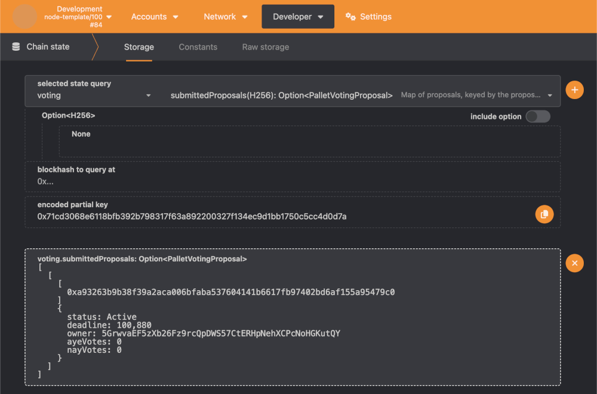
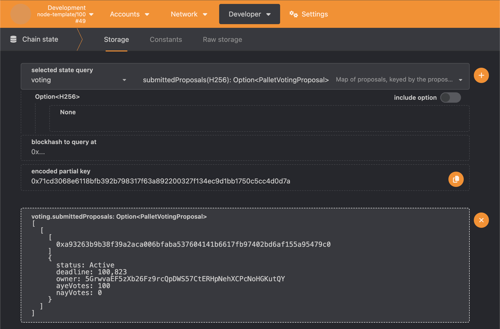
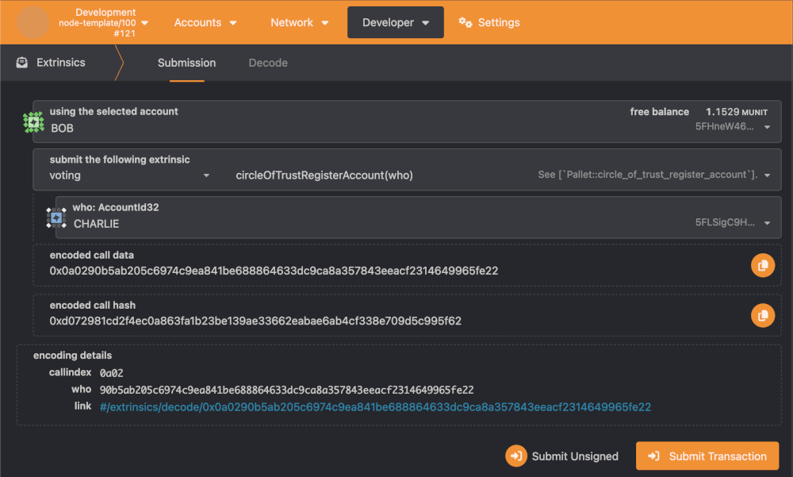
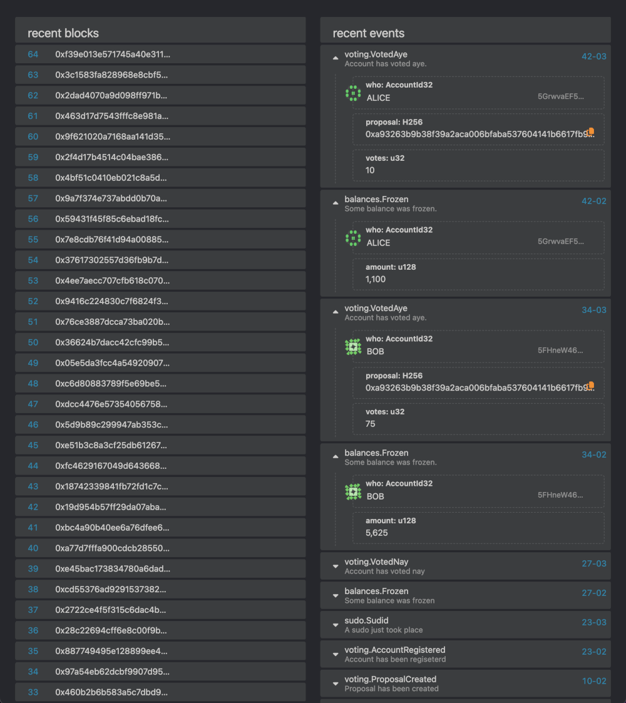

# FRAME voting pallet

This project is an assignment submission for the 4th Polkadot Blockchain Academy taking place
in Hong Kong, 2024.

## Overview

Demonstrated in this project is a functional FRAME pallet with governance features. You are 
able to compile the provided node template and test the voting pallet functionality within 
Polkadot JS Apps. Follow the **Quickstart** and **PolkadotJS walkthrough** sections in
this document for more detailed instructions.

#### Notable features

- Accounts are required to "register" to vote on proposals.
- Registered accounts can submit an extrinsic to register another account (circle of trust).
- Accounts can vote multiple times on a single proposal.
- Accounts can vote on multiple proposals.
- Accounts can claim back their frozen tokens after the associated proposal is closed.
- Closing a proposal is permissionless. Any account can close a proposal after its deadline block has passed.
- The pallet's `Config` trait has parameters to control duration tiers, and the maximum amount of proposals an account can vote on.

#### Notable source files

- `pallets/voting/src/lib.rs`
- `pallets/voting/src/tests.rs`
- `pallets/voting/src/mock.rs`
- `runtime/src/lib.rs`

## Quickstart

Ensure the Rust toolchain is installed on your system.

1. Run the pallet test suite:

    ```
    cargo t -p pallet-voting
    ```

2. Build the node template:
    
    ```
    cargo b -r
    ```

4. Run the built node template:

    ```
    ./target/release/node-template --dev
    ```

3. Build and run the node template:

    ```
    cargo r -r -- --dev
    ```

### Typical usage flow of pallet

This section will briefly detail a typical usage scenario of the voting pallet.

#### 1. An account submits a proposal

  Before voiting can take place, an account must submit a proposal via the `submit_proposal`
  call. A proposal is uniquely identified with the submitting account's ID, along with a 
  hash of the proposal. The hash may represent a digital document and is stored in 
  the blockchain's state as a fingerprint of the actual proposal. The submitter also has to 
  specify a duration, which governs how long the proposal will be active and able to 
  receive votes. The trait allows an implementor to define three duration tiers, which 
  are each represented as a `u8`, signifying how many weeks the proposal will be active.

#### 2. Accounts are registered to enable them to vote on proposals

  In order for an account to vote on proposals, their ID must be recognised as a registered 
  account in the pallet's state. The registration mechanism is a means to prevent sybil
  attacks on the chain. There are two methods in which an account can be registered to the
  pallet. The first method involves the chain's root account submitting a `register_account`
  extrinsic. The second method allows any already-registered account to submit a 
  `circle_of_trust` extrinsic. These extrinsics both contain an account ID to register
  another account to the pallet.

#### 3. Registered accounts vote on proposals

  Registered accounts are able to vote on proposals by submitting the `cast_vote` extrinsic.
  This extrinsic requires the voted proposal's hash, along with how many votes are to be
  cast. Accounts are able to submit __Aye__ or __Nay__ votes to express approval or disapproval
  for the given proposal. Casting a vote requires the account to freeze a portion of their 
  free balance based on a quadratic formula. See the **Quadratic voting mechanism** section 
  to understand how many tokens are frozen per vote. There is also a limit on how many proposals 
  a user can vote on. This limit is configurable on the pallet's `Config` trait via the 
  `MaxProposalsAccountCanVote` type, which is just a `u32` value.

#### 4. Proposal is closed

  A proposal may be closed after its deadline block has passed. Upon closing the proposal,
  its status will change from `Active` to either `Passed` or `Failed` depending on the
  proportion of `Aye` votes to `Nay` votes. A proposal passes if it simply has more "aye"
  votes than "nay" votes, otherwise it fails. Therefore, if a proposal receives absolutely
  no votes, or the aye and nay votes are equal, it will fail. Proposals can be closed 
  permissionlessly providing their respective deadline has passed. This is an important 
  aspect of the system, as voters can only unfreeze their tokens after a proposal is closed 
  (I.e, is not `Active`).

#### 5. Voters claim back their tokens (unfreeze)

  After a proposal is no longer active, voters can claim back (unfreeze) their voting tokens
  by submitting the `claim_back_tokens` extrinsic. One hundred percent of tokens they froze to
  secure their votes for the respective proposal are returned to the account's free balance - 
  provided they have not voted on other currently active proposals.

## Quadratic voting mechanism

The voting mechanism requires an account to freeze a certain amount of native tokens for 
each vote they cast on a proposal. The required amount of tokens to freeze increases 
quadratically as more votes are cast on a particular proposal.

Since proposals are independent and don't require token transfers to another account, 
the same frozen tokens may be used to vote on multiple proposals. As long as the amount
of frozen tokens accommodates the biggest vote on a given proposal, the system will hold.

To demonstrate this concept, consider the following scenario:

- Bob casts **3** votes on `ProposalA`, requiring a frozen balance of **9** tokens.

- Bob casts **2** votes on `ProposalB`, requiring a frozen balance of **4** tokens. 
  Because Bob already has a frozen balance of **9**, no more tokens need to freeze.

- Bob casts **5** votes on `ProposalC`, requiring a frozen balance of **25**. 
  In this case, Bob needs to freeze an additional **16** tokens (25-9) to go through with this vote. 

- Bob strongly approves of `ProposalA` and casts an additional **3** votes.
  Now, Bob has a total of **6** (3+3) votes on this proposal, requiring **36** tokens to be frozen.
  His frozen balance must now increase from **25** to **36**.

- When `ProposalA` is closed, bob tries to claim back his **36** tokens. However, because he
  still has votes on `ProposalB` and `ProposalC`, his frozen balance needs to reflect the 
  highest amount of votes he has cast out of those proposals. In this case, Bob still has **5**
  votes for `ProposalC` and **4** votes for `ProposalB`, therefore requiring a frozen balance
  of **25** tokens.

- Once `ProposalC` and `ProposalB` are closed, Bob can claim back all his frozen tokens.

### Considerations

The total amount of tokens to freeze is calculated based on the total amount of votes cast
by the signer on a given proposal. This implementation has opted to square (multiply the
vote number by itself) to derive the amount of tokens required to freeze, to accomomodate 
those votes.

With this in mind, if an account votes on a proposal multiple times, their frozen balance
needs to be updated correctly. In order to do this, the **total votes cast for a given proposal** is retrieved and squared to calculate the necessary frozen balance to accommodate those votes.

By calculating the amount of tokens an account needs to freeze based on the votes they wish
to cast, the derived token amount is always an exact multiple of the votes cast. Another 
implementation may choose to receive an amount of tokens an account wishes to freeze and 
"turn into votes". In this case, a perfect square root probably won't be derived from the 
sent token amount, further complicating the pallet's logic.

## Extrinsics

This section details the call logic found in the voting pallet's source code. For more detail and insight,
please consult the actual source code.

1. `register_account(origin: OriginFor<T>, who: T::AccountId)`

    - It is ensured that the origin is the root account.
    - The account specified by the `who` argument is added to the `RegisteredAccounts` state.
    - An `AccountRegistered` event is deposited.

2. `circle_of_trust_register_account(origin: OriginFor<T>, who: T::AccountId)`

    - It is ensured that the origin signed the extrinsic.
    - If the signer is a registered account, the account specified by the `who` argument is added to the `RegisteredAccounts` state, and an `AccountRegistered` event is deposited.
    - A `NotRegistered` error is returned if the extrinsic signer is not a registered account.

3. `submit_proposal(origin: OriginFor<T>, proposal: T::Hash, duration: Duration)`

    - It is ensured that the origin signed the extrinsic.
    - Verification ensures that the submitted proposal hash has not already been stored in state. An 
      `AlreadySubmitted` error is returned if the proposal already exists in state.
    - The tier value is calculated, representing the duration the proposal will be active for in weeks.
    - The proposal deadline block is calculated based on the tier value and current block.
    - A new `Proposal` instance is instantiated and persisted to state inside the `SubmittedProposal` 
      storage map.
    - A `ProposalCreated` event is deposited.

4. `cast_vote(origin: OriginFor<T>, proposal: T::Hash, vote: Vote)`

    - It is ensured that the origin signed the extrinsic.
    - Voting conditions are verified to make sure the vote can take place. Checks include:
        - The signer is a registered account.
        - The proposal is still active.
        - The proposal deadline has not passed.
        - It is ensured that the signer has a sufficient free balance to cast the votes later in the function. 
    - The votes are and persisted to state and associated with the associated proposal and signing account.
    - The signer's new frozen balance is updated to accommodate their cast votes.
    - The on-chain proposal metadata is updated to reflect the new votes.
    - A `VotedAye` or `VotedAye` event is deposited.

5. `close_proposal(origin: OriginFor<T>, hash: T::Hash)`

    - It is ensured that the origin signed the extrinsic.
    - The proposal metadata is fetched from state.
    - It is ensured that the proposal is still active, otherwise a `ProposalNotActive` error is returned.
    - If the proposal's deadline block has passed, its status is set to either `Passed` or `Failed`
      as appropriate. Finally, a `ProposalClosed` event is deposited.

6. `claim_back_tokens(origin: OriginFor<T>, proposal_hash: T::Hash)`

    - It is ensured that the origin signed the extrinsic.
    - The proposal metadata is fetched from state.
    - Verification takes place to ensure the proposal is closed, otherwise a `ProposalStillActive`
      error is returned.
    - The proposal hash is removed from the signer's proposals vector stored in the `AccountProposalsMap`
      storage map.
    - The signer's committed votes are removed from the `AccountVotes` double storage map.
    - The signer's new frozen balance is updated to accommodate their votes cast on other proposals.
      If the signer has not voted on any other proposals, their new frozen balance will be zero.
    - A `TokensClaimed` event is deposited.

## PolkadotJS walkthrough

The following steps demonstrate how to use the voting pallet on PolkadotJS apps. In order to 
submit extrinsics with test accounts with zero balance, make a transfer from the pre-funded 
Alice and Bob accounts.

#### Step 1:

Submit a call extrinsic from the `sudo` pallet to register the Bob account to the `voting` pallet.



#### Step 2:

Check the chain state's `registeredAccounts` map to confirm the registered account.



#### Step 3:

Alice submits a new Tier 1 proposal via the voting pallet's `submitProposal` extrinsic.



#### Step 4:

Check the chain state's `submittedProposals` map to confirm the proposal data.



#### Step 5:

Bob casts 100 aye votes on Alice's proposal via the voting pallet's `castVote` extrinsic.


#### Step 6:

Check the chain state's `submittedProposals` map to confirm the proposal has received 100 aye votes.



#### Step 7:

Bob registers the Charlie account to enable it to vote on proposals as well.



#### Step 8:

Review block events to confirm persisted votes and frozen balances.

